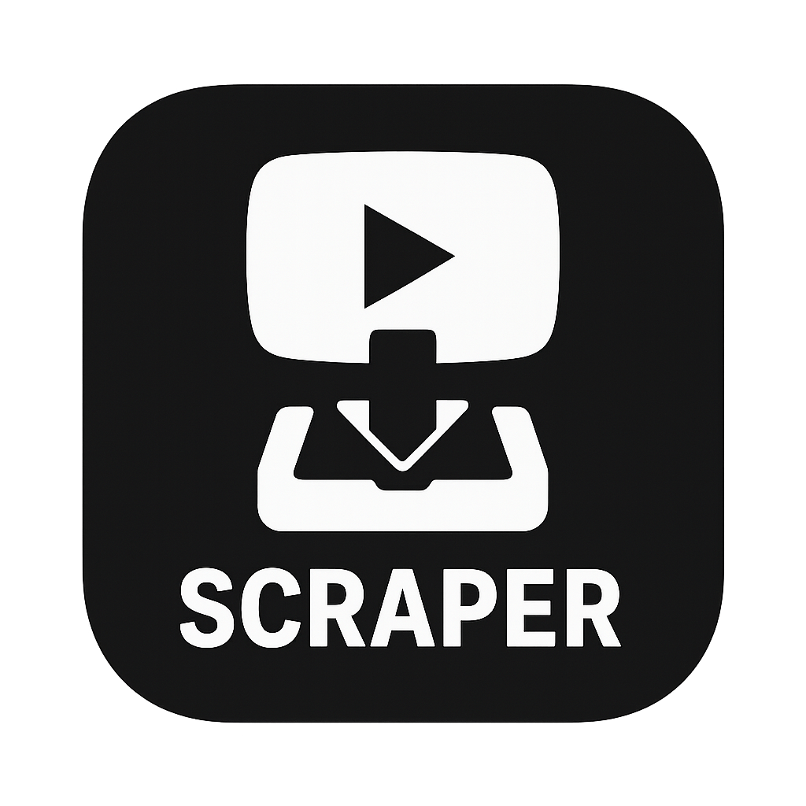
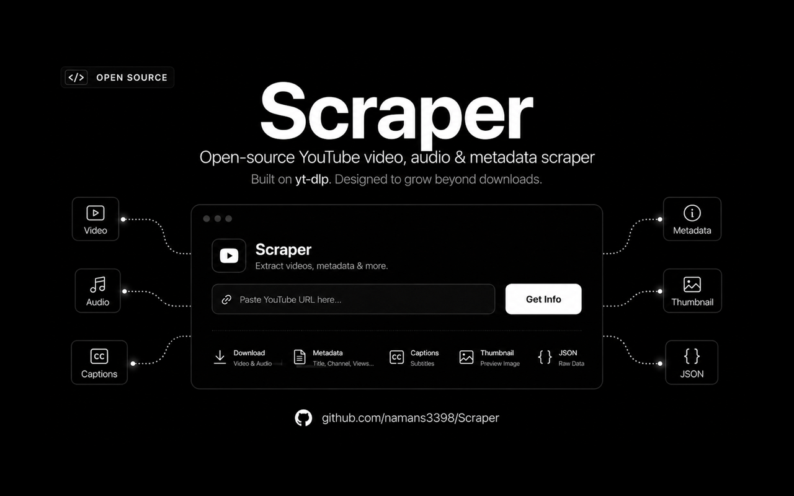
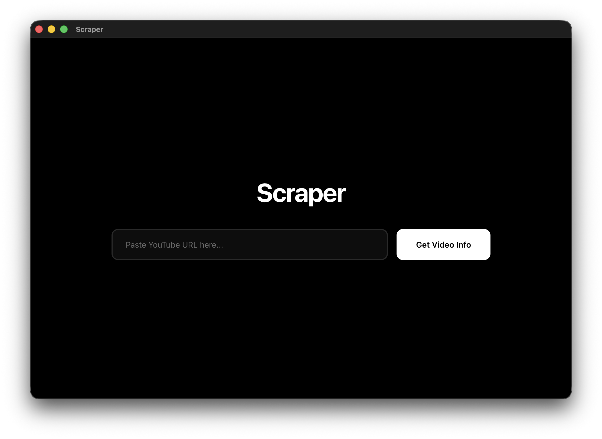
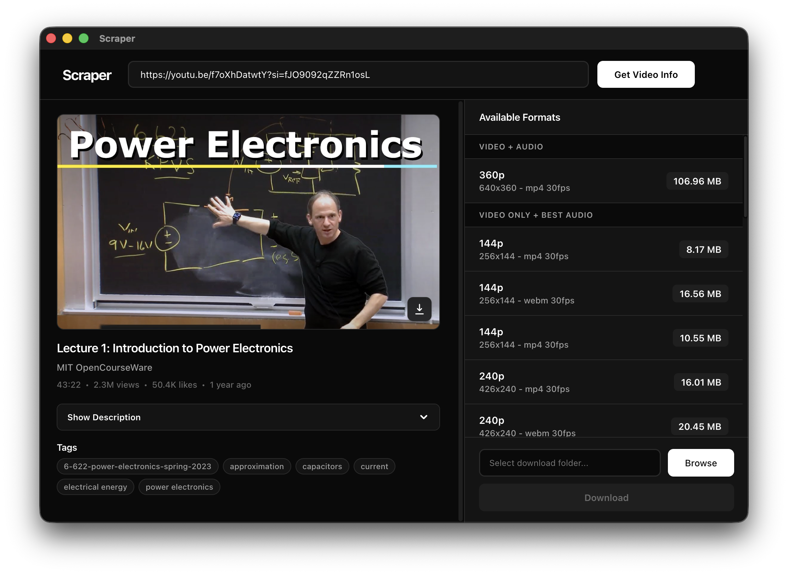
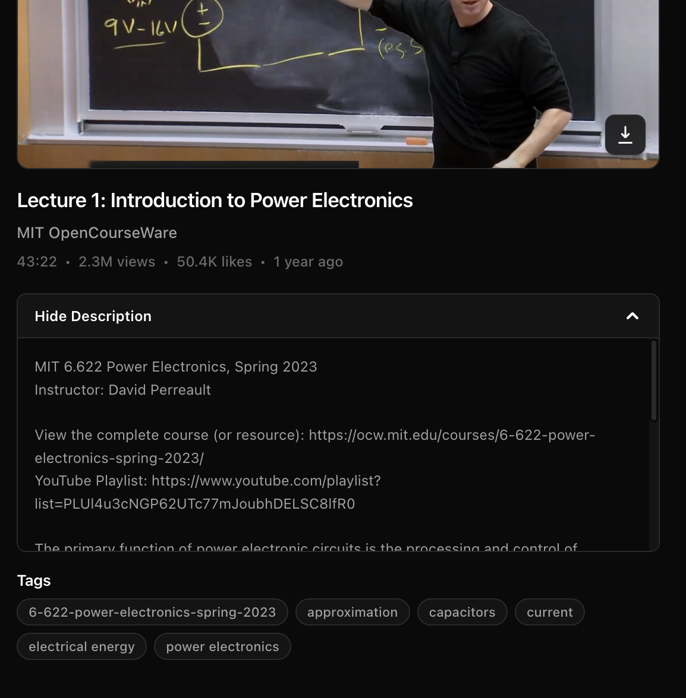

<div align="center">
  <h1>
    
    Scraper
  </h1>
  <p><strong>A secure, open-source desktop video downloader powered by <code>yt-dlp</code>.</strong></p>
  <p>
    <a href="https://github.com/namans3398/Scraper/actions/workflows/build.yml">
      
    </a>
    <a href="LICENSE">
      
    </a>
    
    
  </p>
  <p>
    <a href="#features">Features</a> ·
    <a href="#screenshots">Screenshots</a> ·
    <a href="#quick-start">Quick Start</a> ·
    <a href="#documentation">Documentation</a> ·
    <a href="#contributing">Contributing</a> ·
    <a href="#license">License</a>
  </p>
  <p>
    
  </p>
</div>

## Overview

Scraper is a focused Electron application for downloading videos through `yt-dlp`. It helps you fetch video metadata, inspect available formats, choose an output folder, download thumbnails, and track download progress from a clean desktop interface.

The first production-ready release is **macOS-first**. Windows and Linux package targets exist for contributor testing, but they are not considered supported release platforms until they have dedicated validation, signing, and release coverage.

## Screenshots

<p>
  
</p>

<p>
  
</p>

<p align="center">
  
</p>

## Features

- Fetch video metadata through `yt-dlp`.
- Display title, channel, duration, upload metadata, thumbnail, tags, and available formats.
- Download selected video and audio formats to a user-selected folder.
- Download thumbnails separately.
- Detect and update local `yt-dlp` and `ffmpeg` dependencies.
- Run with Electron security controls, including context isolation, sandboxing, disabled renderer Node.js integration, validated IPC, and a local Content Security Policy.
- Keep user privacy simple: no analytics, telemetry, or trackers.

## Requirements

| Requirement | Notes |
| --- | --- |
| macOS 13+ | Supported target for the first public release. |
| Node.js 20+ | Required for source builds and development. |
| `yt-dlp` | Required for metadata fetching and downloads. |
| `ffmpeg` | Required when a selected format needs audio/video merging. |

Install runtime tools on macOS with Homebrew:

```bash
brew install yt-dlp ffmpeg
```

## Quick Start

```bash
git clone https://github.com/namans3398/Scraper.git
cd Scraper
npm install
npm start
```

Run the full local quality gate before opening a pull request:

```bash
npm run check
```

`npm run check` runs ESLint, TypeScript checking, and the Node test suite.

## Development

```bash
npm run dev          # Start Electron in development mode
npm run lint         # Run ESLint
npm run type-check   # Run TypeScript checks
npm test             # Run the Node test suite
npm run build:mac    # Build the supported macOS package
```

Artifacts are written to `dist/`. Windows and Linux build scripts are available for contributor testing only:

```bash
npm run build:win
npm run build:linux
npm run build:all
```

## Security Model

Scraper handles URLs, local file paths, external downloads, and command execution. Security-sensitive changes should preserve these project rules:

- Validate IPC input at preload and main process boundaries.
- Launch external tools with argument arrays instead of shell strings.
- Keep renderer Node.js integration disabled.
- Avoid remote renderer content unless there is a reviewed security reason.
- Preserve output-path, URL, redirect, size, and timeout checks.

Please report vulnerabilities through the [Security Policy](docs/SECURITY.md).

## Documentation

- [Installation Guide](docs/INSTALL.md)
- [Building from Source](docs/BUILD.md)
- [Security Policy](docs/SECURITY.md)
- [Project Structure](docs/PROJECT_STRUCTURE.md)
- [Contributing Guide](docs/CONTRIBUTING.md)
- [Code of Conduct](docs/CODE_OF_CONDUCT.md)
- [FAQ](docs/FAQ.md)
- [Production Checklist](docs/PRODUCTION_CHECKLIST.md)

## Release Status

Public binaries for the first release should be published as unsigned draft GitHub release artifacts until code signing and notarization are configured. macOS users may need to approve the app manually in System Settings when testing unsigned builds.

## Contributing

Contributions are welcome. Before opening a pull request:

1. Search existing issues and pull requests.
2. Keep changes scoped to one bug, feature, or documentation update.
3. Add or update tests for behavior changes.
4. Update documentation when commands, supported platforms, security posture, or release behavior changes.
5. Run `npm run check` locally.

Read the full [Contributing Guide](docs/CONTRIBUTING.md) and [Code of Conduct](docs/CODE_OF_CONDUCT.md) before participating.

## Contributors

Thanks to everyone who helps build, test, document, and maintain Scraper.

<table>
  <tr>
    <td align="center">
      <a href="https://github.com/namans3398">
        
        <br>
        <sub><strong>Naman Singh Rao</strong></sub>
      </a>
      <br>
      <sub>Maintainer</sub>
    </td>
  </tr>
</table>

See the full contributor history on the [GitHub contributors page](https://github.com/namans3398/Scraper/graphs/contributors).

## License

Scraper is licensed under the [MIT License](LICENSE).

## Legal Notice

Scraper is a graphical frontend for `yt-dlp`. Use it only with content you have the right to access and download. You are responsible for complying with website terms of service, copyright law, and local regulations.
